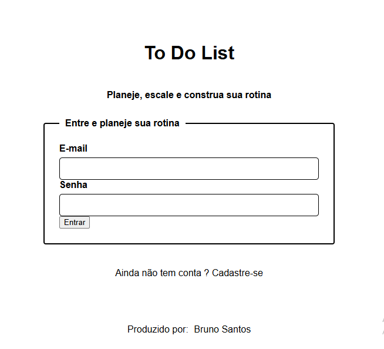
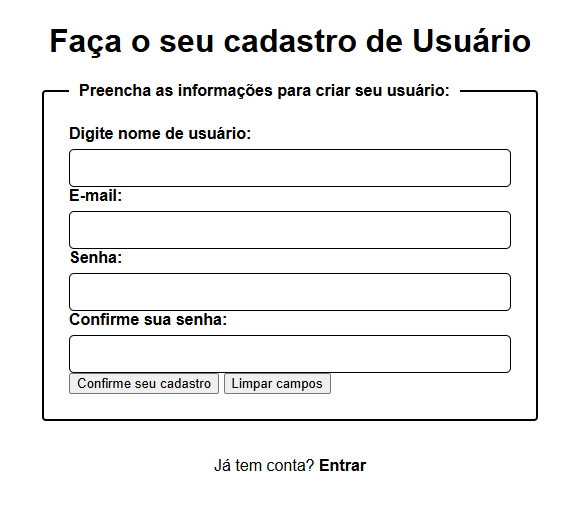
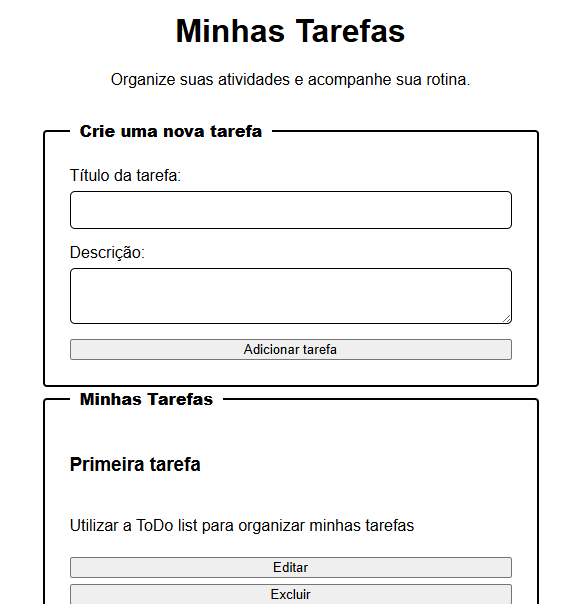

# 📝 API ToDo List Fullstack

Este é um projeto Fullstack desenvolvido a partir do desafio da plataforma Roadmap.sh para gerenciamento de tarefas. A aplicação foi construída utilizando Flask no backend e HTML, CSS e JavaScript no frontend, permitindo que usuários realizem cadastro, login e gerenciamento completo de suas tarefas através de uma interface web integrada.

A autenticação é realizada utilizando JWT (JSON Web Token), garantindo que cada usuário tenha acesso apenas às suas próprias tarefas.

---

## 🚀 Tecnologias Utilizadas

### Backend

* Python 3
* Flask
* Flask-RESTful
* Flask-SQLAlchemy
* Flask-JWT-Extended
* Bcrypt
* SQLite

### Frontend

* HTML5
* CSS3
* JavaScript 

### Segurança

* JWT (JSON Web Token)
* Hash de senhas com Bcrypt
* Blacklist de Tokens para Logout Seguro

---

## ✅ Funcionalidades

### Usuários

* Cadastro de usuários
* Login autenticado com JWT
* Logout seguro utilizando blacklist de tokens

### Tarefas

* Criar tarefas
* Visualizar tarefas
* Editar tarefas
* Excluir tarefas
* Filtrar tarefas
* Paginação de resultados

### Interface Web

* Tela de Login     
* Tela de Cadastro     
* Dashboard para gerenciamento de tarefas    
* Integração completa entre Frontend e Backend

---

## 🖥️ Interface da Aplicação

A aplicação possui uma interface web desenvolvida para facilitar a interação com a API.

Fluxo de utilização:

* Cadastro de usuário
* Login
* Criação de tarefas
* Atualização de tarefas
* Exclusão de tarefas
* Logout

---

## ⚙️ Requisitos

Certifique-se de possuir o Python 3 instalado em sua máquina.

Verifique executando:

```bash
python --version
```

---

## 🧰 Instalação

### 1. Clone o repositório

```bash
git clone https://github.com/bruunovsanttos/APIToDoList.git
```

### 2. Acesse a pasta do projeto

```bash
cd APIToDoList
```

### 3. Crie um ambiente virtual

```bash
python -m venv venv
```

### Ative o ambiente virtual

#### Windows

```bash
venv\Scripts\activate
```

#### Linux / macOS

```bash
source venv/bin/activate
```

### 4. Instale as dependências

```bash
pip install -r requirements.txt
```

Caso necessário, gere novamente o arquivo requirements:

```bash
pip freeze > requirements.txt
```

---

## 🔄 Como Executar

Inicie a aplicação com:

```bash
python run.py
```

A aplicação estará disponível em:

```text
http://127.0.0.1:5000
```

---

## 🌐 Rotas Principais

### Interface Web

| Rota       | Descrição        |
| ---------- | ---------------- |
| /          | Tela de Login    |
| /register  | Tela de Cadastro |
| /dashboard | Dashboard        |

### API

| Método | Endpoint    | Descrição           |
| ------ | ----------- | ------------------- |
| POST   | /user       | Cadastro de usuário |
| POST   | /login      | Login               |
| POST   | /logout     | Logout              |
| GET    | /tasks      | Listar tarefas      |
| POST   | /tasks      | Criar tarefa        |
| PUT    | /tasks/<id> | Atualizar tarefa    |
| DELETE | /tasks/<id> | Excluir tarefa      |

---

## 🔐 Segurança

* Senhas armazenadas utilizando hash com Bcrypt
* Autenticação baseada em JWT
* Proteção de rotas com `@jwt_required`
* Controle de acesso por usuário
* Blacklist de tokens para logout seguro

---

## 📁 Organização do Projeto

```text
APIToDoList/
│
├── app/
│   ├── models/
│   │   ├── task.py
│   │   └── user.py
│   │
│   ├── routes/
│   │   ├── task.py
│   │   ├── user.py
│   │   └── web.py
│   │
│   ├── services/
│   │
│   ├── templates/
│   │   ├── login.html
│   │   ├── register.html
│   │   └── dashboard.html
│   │
│   ├── static/
│   │   ├── css/
│   │   └── js/
│   │
│   ├── extensions.py
│   └── blacklist.py
│
├── banco.db
├── run.py
├── requirements.txt
└── README.md
```

---

## 📌 Status do Projeto

✅ Versão 1.0 concluída

Funcionalidades implementadas:

* CRUD completo de tarefas
* Autenticação JWT
* Interface Web
* Integração Frontend e Backend
* Controle de acesso por usuário
* Arquitetura organizada utilizando Factory Pattern

---

## 🚀 Melhorias Futuras

* Refresh Token
* Recuperação de senha
* Docker
* Deploy automatizado
* Testes automatizados
* Integração com PostgreSQL
* Melhorias de UX/UI

---

## 👨‍💻 Contribuindo

Contribuições são bem-vindas.

Você pode:

* Abrir uma Issue
* Criar um Fork
* Enviar um Pull Request

---

## 📄 Licença

Este projeto está licenciado sob a licença MIT.

---

## 👤 Autor

Feito com 💻 e ☕ por Bruno Vieira Santos

🔗 LinkedIn:
https://www.linkedin.com/in/brunovieirasantos/
